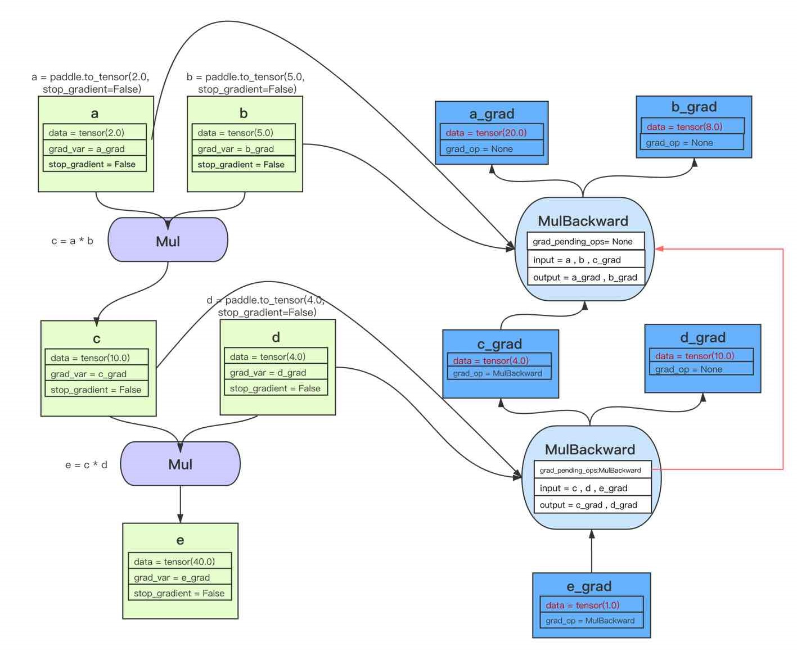
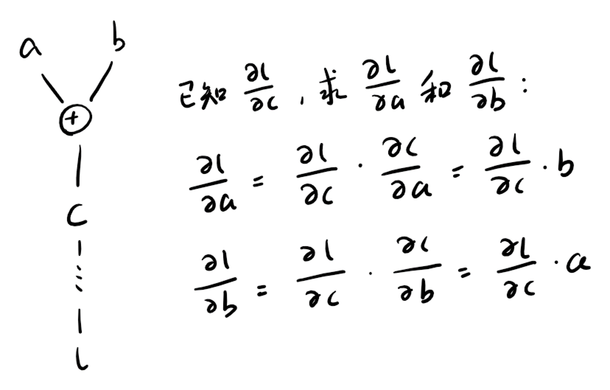
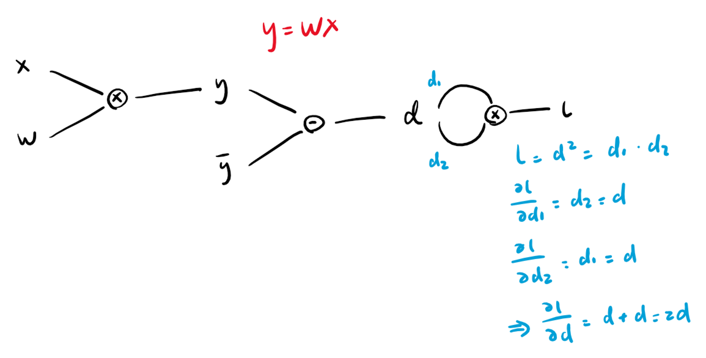
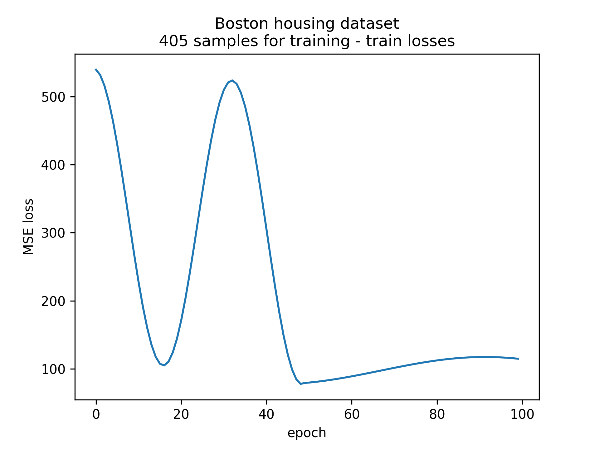
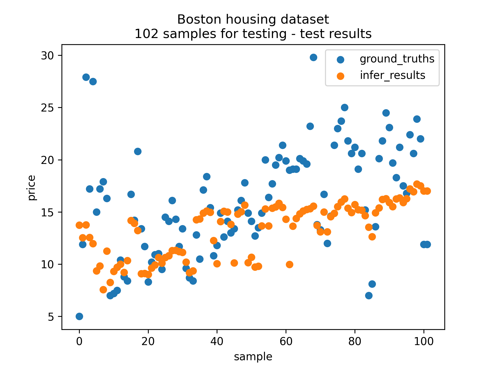

# AutoGrad

仿写一个[自动微分机](https://www.paddlepaddle.org.cn/documentation/docs/zh/guides/advanced/autograd_cn.html)，数据结构与下图相似

玩具示例，功能有限，存在内存泄漏未解决



## 1. 运行

环境 Ubuntu 20.04

Boston房价预测

```
cd ./examples/Boston
make
./bin/ExampleBoston.out & python ./plot.py
```

XOR分类器
```
cd ./examples/XOR
make
./bin/ExampleXOR.out & python ./plot.py
```

## 2. 基本原理

### 2.1 梯度传播原理 - 链式法则

在前向计算的同时构建计算图。反向传播的梯度计算方式如下图，以加法OP为例，



a加b等于c，c再经过某些计算得到l，假设已知l对c的偏导数，可使用链式法则求l对a和对b的偏导数。

前面假设了已知c的梯度，这就对方向传播的顺序有要求。

### 2.2 反向传播的顺序问题

如下图的例子中，要求l对其他变量的偏导数，首先可以求l对自身的导数为1，接着便可以计算以l为输出的乘法OP相关的梯度。

那么什么时候可以计算以d为输出的减法OP相关的梯度呢？按照前面的讨论，需要至少等到d的梯度计算完成时才可以进行。而d的梯度是由两部分相加而成的，假设我们先计算了d1的梯度，此时通过计数发现d的梯度还差一个部分，表明减法OP还不能开始计算，而当计算完d2的梯度后，再次检查发现d的梯度已完整，表明减法OP已可计算。以此类推，可以确定一个可行的计算顺序。

当我们发现一个OP相关的梯度可以计算时，就将这个OP添加到一个全局队列中，反向传播的过程就是不断从这个队列的头部取OP进行计算，直至队列为空。



## 3. 基于线性回归的波士顿房价预测任务

in `examples/Boston/ExampleBoston.cpp`

```C++
// 计算误差
Mat y_pred = trainX_norm * W + b;
Mat diff = y_pred - trainY;
Mat se_loss = diff.transpose() * diff;
se_loss = se_loss / trainNum;

// ...

// 反向传播
se_loss.backward();
// 更新参数
W.update(lr_rate);
b.update(lr_rate);
```

训练损失



测试结果



## 4. XOR 二分类任务

网络结构

$$Logits(x;W,c,w,b) = w^T\textnormal{sigmoid}(W^Tx+c)+b$$

$$Prob_{y=0} = \textnormal{sigmoid}(Logits(x))$$


```C++
// 计算误差
Mat X_norm = bn0(X, 0);
Mat h = sigmoid(X_norm*W+c.transpose()); // ([4,2]*[2,2] + [1,2]) = [4,2]
Mat h_norm = bn1(h, 0); // [4,2]
Mat y_pred = h_norm*w + b.transpose(); // [4,2]*[2,1] + [1,1] = [4,1]
Mat loss = BCEWithLogitsLoss(y_pred, Y, ones); // [1,1]
Mat mean_loss = loss / num;
```

训练损失

容易困在局部最优点，将所有点归为一类，达到0.5准确率

结合了动量梯度下降和BatchNormalization来解决

这里的BatchNormalization没有让gamma和beta为可学习

|batchNorm\momentum|×|√|
|:---:|:---:|:---:|
|×|||
|√|||