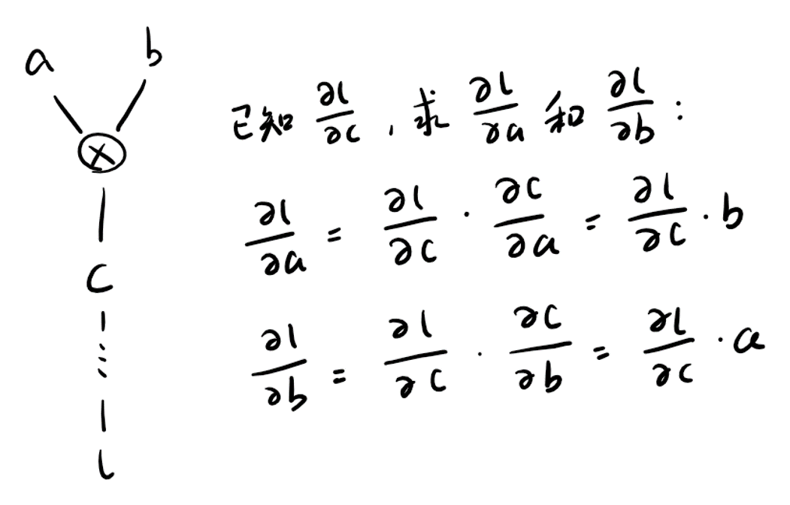

# AutoGrad

按照自己的想法仿写一个[自动微分机](https://www.paddlepaddle.org.cn/documentation/docs/zh/guides/01_paddle2.0_introduction/basic_concept/autograd_cn.html)，数据结构与下图相似


## 运行

```
make && ./bin/autograd.out
```

## 基本原理

在前向计算的同时构建计算图。反向传播的梯度计算方式如下图，以加法为例：


## 以波士顿房价预测为例

训练损失


测试结果

